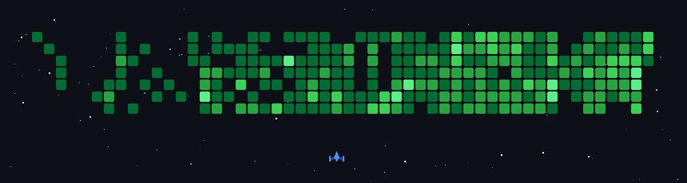

Yo 👋🏻

I'm **[Shawn](https://www.linkedin.com/in/shawn-chee/)**, a software engineer who breaks and builds things onchain and off.

Breaking & building:

* 🤖 building agentic AI systems and LLM-powered pipelines.
* ⛓️ hacking on DeFi protocols and onchain infra.
* 🛡️ shipping developer tools and indie building products.
* 🏆 winning hackathons (9x national, still going).
* 👌🏻 contributing to open-source projects.
* ⚽️ enjoying life.

i write sometimes **[here](https://substack.com/@byshawnchee)** · 🌐 more at **[shawnchee.com](https://shawnchee.com)** · 💬 find me **[@NotShawnChee](https://x.com/NotShawnChee)**

---

**things i've built:**

*products & onchain*

- **[polynuts](https://github.com/Shawnchee/polynuts)** — non-custodial crypto prediction market on Base · pump/dump/range bets settled trustlessly on Thetanuts options vaults
- **[Vestra](https://github.com/Shawnchee/Vestra)** — AI research desk for pre-IPO tokens on Solana · Bull, Bear & Neutral analysts debate the same evidence, a Council checks it and writes a cited brief
- **[ParkTheBus](https://github.com/Shawnchee/ParkTheBus)** — peer-to-peer football prediction market on Solana · post an RFQ for any event ("Ronaldo to cry"), market makers quote the odds, settled on-chain with zero house edge
- **[bequeath](https://github.com/Shawnchee/bequeath)** — Uniswap v4 hook that makes an LP position inheritable and self-funds a monthly annuity from its own fees · *submission for the Uniswap Hook Incubator program*
- **[AgentProof](https://github.com/Shawnchee/AgentProof-OWS)** — cryptographic work receipts for AI agents · proves who did the work and that nothing was tampered with
- **[HedgeLP](https://github.com/Shawnchee/HedgeLP)** — delta-neutral Uniswap v4 LP with atomic GMX hedging

*agent skills & dev tools*

- **[caveman-skill](https://github.com/Shawnchee/caveman-skill)** ⭐ 78 — minimal Claude skill for hunting bugs, not vibing
- **[frontend-god-mode](https://github.com/Shawnchee/frontend-god-mode)** ⭐ 15 — every famous frontend design skill, in one skill
- **[preflight-skill](https://github.com/Shawnchee/preflight-skill)** ⭐ 8 — production-readiness scanner · 780 checks across 6 deploy types, with file + line precision
- **[rpc-optimize](https://github.com/Shawnchee/multichain-rpc-optimize-skill)** — agent skill that cuts JSON-RPC cost on EVM & Solana (Alchemy, Infura, Ankr, QuickNode, Helius) · ships a benchmark harness that proves the savings on your own endpoint
- **[design-scan](https://github.com/Shawnchee/design-scan)** — Claude Code skill that scans any live website into a replication-grade design.md — layout, typography, colors & animations via a bundled Playwright crawler
- **[solana-roast-skill](https://github.com/Shawnchee/solana-roast-skill)** — adversarial pre-ship interrogation skill for Solana programs · walks the design decision-tree one question at a time before an audit
- **[content-negotiation-for-agents](https://github.com/Shawnchee/content-negotiation-for-agents-skill)** — Next.js skill that serves clean Markdown to AI agents and HTML to browsers from the same URL
- **[perfpatch](https://github.com/Shawnchee/perfpatch)** — one command to diagnose Lighthouse, bundle bloat & dead code and hand ready-to-apply fixes to your IDE's AI agent · zero external API calls
- **[gitresume](https://github.com/Shawnchee/gitresume)** — turn any public git repo into CV-ready resume bullets
- **[claude-pomodoro](https://github.com/Shawnchee/claude-pomodoro)** ⭐ 4 — pixel-art Claude mascot pomodoro timer · native on macOS, Electron on Windows & Linux
- **[PR Auditor](https://github.com/Shawnchee/the-auditor)** — automated Solidity/Rust/Move smart contract auditor on every PR
- **[VibeGuard](https://github.com/Shawnchee/VibeGuard-Extension)** — VS Code extension that scans staged changes for leaked secrets and vulns
- **[thetanuts-mcp-server](https://github.com/Shawnchee/thetanuts-mcp-server)** — MCP server for Thetanuts SDK v4 · since migrated into the official **[Thetanuts SDK](https://github.com/Thetanuts-Finance/thetanuts-sdk)**

*hackathon wins* 🏆

- **[Consilium](https://github.com/Shawnchee/Consilium-1st-place-in-UMHackathon2026-)** — AI vet copilot: pre-consult briefs, live note-taking, Telegram triage · *1st @ UMHackathon 2026*
- **[BizKuKu](https://github.com/Shawnchee/BizKuKu-PayHack2025-Champion)** — all-in-one digital growth platform for Malaysian MSMEs · *Champion @ PayHack 2025*
- **[AutoValidate](https://github.com/Shawnchee/Codenection2025-2nd-Place-AutoValidate-Backend-API)** — semantic validation API with OCR, embeddings, and typo correction · *2nd @ Codenection 2025*
- **[DermaNow](https://github.com/Shawnchee/DermaNow-UMHackathon25-4th-Place)** — Malaysia's first Shariah-compliant blockchain charity · *4th @ UMHackathon 2025*
- **[paperfans](https://github.com/Shawnchee/paperfans-IOTA-Hackathon-Malaysia-5th-Place)** — Web3 science-funding platform · *5th @ IOTA Hackathon Malaysia*
- **[BuddyKu](https://github.com/Shawnchee/Buddyku-Innovation-Excellence-Award-Great-AI-Hackathon)** — AI mental health journaling with crisis detection · *Innovation Excellence Award*
- **[ScamBusters](https://github.com/Shawnchee/finhack-i-love-tng)** — pre-transaction scam detection for Malaysian consumers · *TNG FinHack 2026*
- **[SubMint](https://github.com/Shawnchee/SubMint-SuperTeamMY-Solana-Hackathon-2025-Finalist_Solo)** — decentralised subscription manager that tokenizes shared subscriptions as NFTs · *Finalist (solo) @ SuperTeam MY Solana Hackathon 2025*
- **[BlockChair](https://github.com/Shawnchee/BlockChair-VHACK25-Finalist)** — transparent milestone-based decentralised charity platform · *VHACK25 Finalist*

*earlier builds:* [WInTheChat](https://github.com/Shawnchee/WInTheChat) · [ECHO](https://github.com/Shawnchee/ECHO) · [SolSecure](https://github.com/Shawnchee/SolSecure) · [commit-writer](https://github.com/Shawnchee/vscode-gemini-conventional-commit-writer)

## 👾 GitHub Contribution

